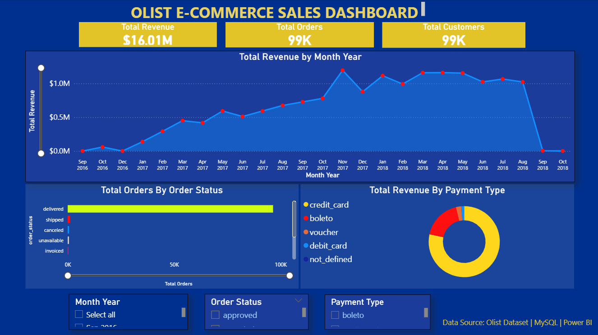
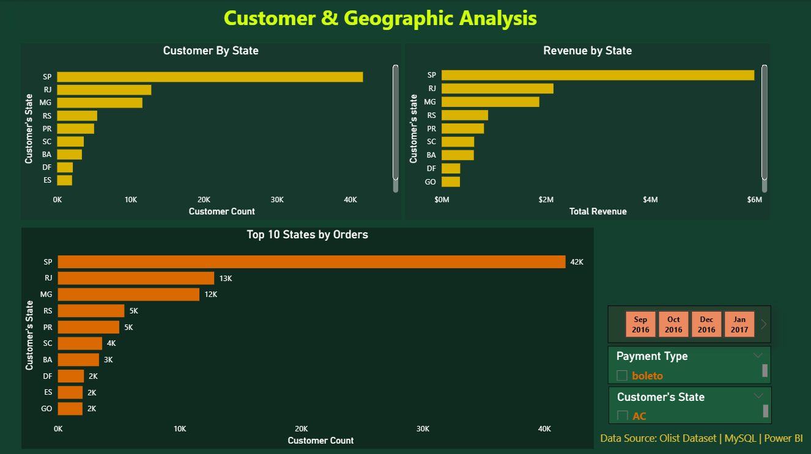

# Olist E-Commerce Sales Analytics Dashboard

> Analyzed **99,441 orders** across a Brazilian e-commerce platform — uncovering that **78% of revenue flows through credit card**, **98% of orders are successfully delivered**, and **São Paulo alone accounts for 42% of the customer base**.



---

## Skills Demonstrated

`MySQL` &nbsp;`Power BI` &nbsp;`Data Cleaning` &nbsp;`SQL Aggregation` &nbsp;`CTEs` &nbsp;`Time Series Analysis` &nbsp;`Geographic Analysis` &nbsp;`KPI Dashboarding`

---

## Key Findings

| # | Insight |
|---|---------|
| 1 | Credit card drives **78.3% of revenue** (BRL 12.5M of 16.0M total) — boleto is a distant second at 17.9% |
| 2 | **August is peak month** — 10,843 orders and BRL 1.69M revenue, with May close behind |
| 3 | **98% delivery rate** — only 625 of 99,441 orders canceled, signaling strong operational health |
| 4 | **SP dominates geography** — São Paulo holds 41,746 customers; many states have fewer than 100 |
| 5 | Revenue drops sharply post-August — reflects partial dataset coverage, not a business decline |

---

## Dashboard

### Executive Overview

KPIs · Monthly Revenue Trend · Orders by Status · Revenue by Payment Type

### Customer & Geographic Analysis

Customers by State · Revenue by State · Top 10 States by Orders

---

## Dataset

[Olist Brazilian E-Commerce Dataset](https://www.kaggle.com/datasets/olistbr/brazilian-ecommerce) — 5 tables, 99K+ records.

| Table | Records |
|-------|---------|
| customers | 99,441 |
| orders | 99,441 |
| order_items | 112,650 |
| order_payments | 103,886 |

---

## Data Cleaning Highlights

Performed full quality checks across all 5 tables in MySQL:

- **Zero critical issues** — no nulls, blanks, or duplicates in primary key columns
- **9 zero-value payments** identified and excluded from revenue calculations
- **1,783 missing carrier dates** — all belong to non-delivered orders (expected and consistent)
- **State codes validated** against regex `^[A-Z]{2}$` — all passed

---

## SQL Analysis Snapshot

```sql
-- Total Revenue
SELECT ROUND(SUM(payment_value), 2) AS Total_Revenue
FROM order_payments WHERE payment_value > 0;
-- Result: 16,008,872.12

-- Monthly Revenue Trend
SELECT MONTHNAME(o.order_purchase_timestamp) AS Month,
       ROUND(SUM(op.payment_value), 2) AS Revenue
FROM orders o JOIN order_payments op ON o.order_id = op.order_id
WHERE op.payment_value > 0
GROUP BY MONTH(o.order_purchase_timestamp), MONTHNAME(o.order_purchase_timestamp)
ORDER BY MONTH(o.order_purchase_timestamp);
```

Full queries → [`SQL/01_data_cleaning.sql`](SQL/01_data_cleaning.sql) · [`SQL/02_data_analysis.sql`](SQL/02_data_analysis.sql)

---

## Project Structure

```
Olist-Ecommerce-Sales-Dashboard/
├── SQL/
│   ├── 01_data_cleaning.sql
│   └── 02_data_analysis.sql
├── PowerBI/
│   └── Olist_Ecommerce_Dashboard.pbix
├── Images/
│   ├── page1_dashboard.png
│   └── page2_customer_analysis.png
└── README.md
```

---

## Author

**Ranjan Kumar Mandal** · 2025KPAD1015 · M.Tech, IIIT Kota

`SQL` `Excel` `Power BI` `Python`
